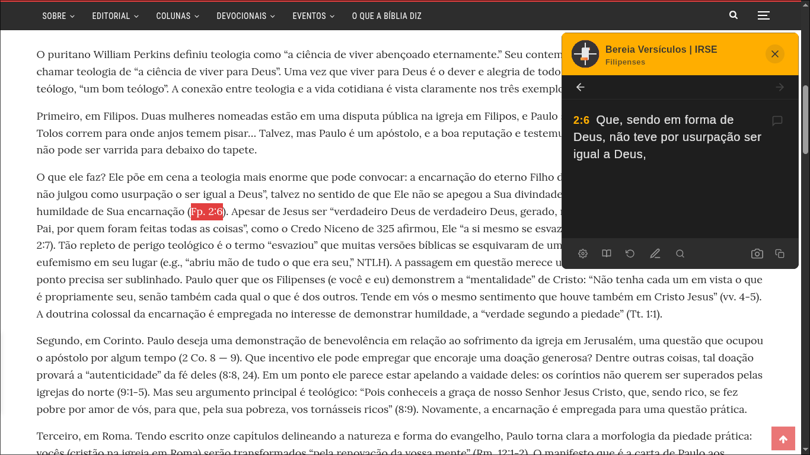

  
# Bereia Versículos

**Um ecossistema de ferramentas para leitura e anotação bíblica, projetado para ser integrado e multiplataforma.**

O Bereia Versículos é um projeto do [Instituto Reformado Santo Evangelho (IRSE)](https://irse.com.br) que visa facilitar o acesso e o estudo das Escrituras Sagradas. Ele transforma automaticamente referências de versículos em texto legível, onde quer que você esteja: no seu desktop, navegando na web ou em seu site WordPress.

---

## ✨ Projetos no Repositório

Este monorepo contém vários pacotes que trabalham juntos para criar o ecossistema Bereia Versículos.

| Projeto | Diretório | Tecnologia | Propósito |
| :--- | :--- | :--- | :--- |
| 🖥️ **App Desktop** | `/app` | Kotlin Multiplatform | Aplicativo nativo para Windows, macOS e Linux com recursos de anotações, histórico e sincronização na nuvem. |
| 🌐 **Site Principal** | `/web` | Wordpress / Nuxt.js | A página inicial do projeto, com a Política de Privacidade e links para download dos aplicativos. |
| 🧩 **Extensão Chrome** | `extensions/ext-bereia-verse` | JavaScript | Detecta e exibe versículos bíblicos em qualquer página da web que você visitar. |
| 🔌 **Plugin WordPress** | `extensions/wp-bereia-verse` | PHP / JavaScript | Leva a funcionalidade de detecção de versículos para o seu site ou blog WordPress. |
| ⚙️ **Servidor** | `/workers` | Cloudflare Workers | Fornece a API utilizada pelas aplicações web. |
| 🐧 **Linux** | `/linux` | Shell | Arquivos de compilação e instalaçao para Linux.
---

Para instruções detalhadas de como compilar e rodar cada projeto, consulte o nosso **[Guia de Desenvolvimento](./docs/desenvolvimento.md)**.

---

## 릴 Releases e Instalação

Os pacotes de instalação para todos os aplicativos podem ser encontrados nas lojas oficiais ou na [**página de Releases**](https://github.com/Instituto-Reformado-Santo-Evangelho/bereia-verse/releases) do projeto.

Para guias de instalação detalhados, acesse a pasta `docs`:
- **[Instalação do App Desktop](./docs/app-desktop.md)**
- **[Instalação da Extensão para Chrome](./docs/extensao-chrome.md)**
- **[Instalação do Plugin para WordPress](./docs/plugin-wordpress.md)**

 

---

## 📄 Licença

O código-fonte deste projeto é licenciado sob a **Creative Commons Atribuição-NãoComercial-SemDerivações 4.0 Internacional (CC BY-NC-ND 4.0)**.

Isso significa que você é livre para copiar e redistribuir o material em qualquer meio ou formato, desde que:
- Dê o crédito apropriado ao **Instituto Reformado Santo Evangelho (IRSE)**.
- Não utilize o material para fins comerciais.
- Não distribua material modificado.

Veja o arquivo [`LICENSE`](./LICENSE) para o texto completo da licença.

**Nota sobre Conteúdo:** Esta licença se aplica ao código-fonte do projeto. O texto da Bíblia possui seus próprios direitos autorais, que devem ser respeitados conforme os termos de seus detentores. O **Bereia Versículos** tem autorização para usar o Texto da Bíblia Almeida Corrigida Fiel (ACF), cedidos gentilmente pela [**Sociedade Bíblica Trinitariana do Brasil (SBTB)**](https://biblias.com.br/sobre).
